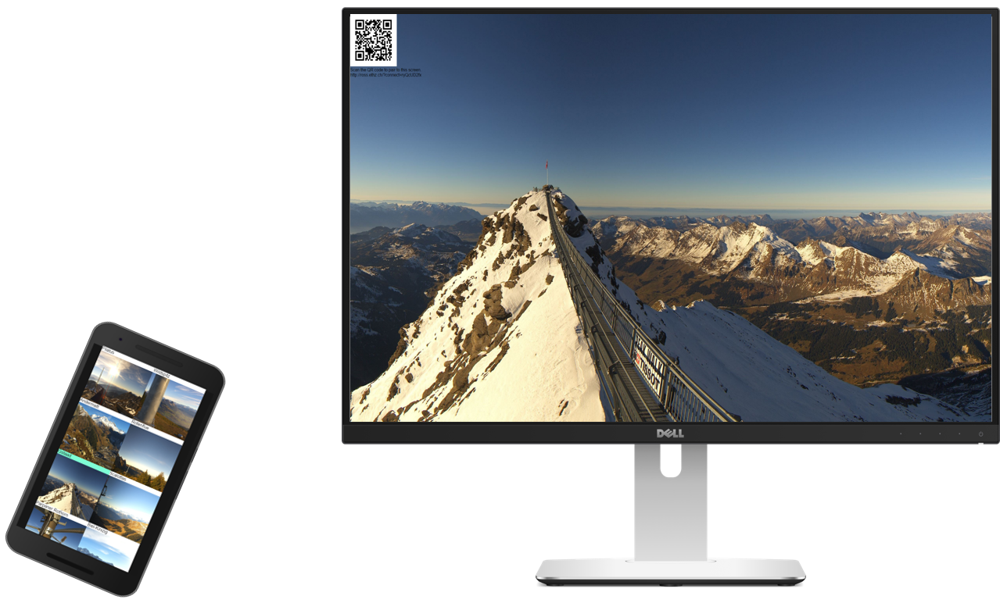
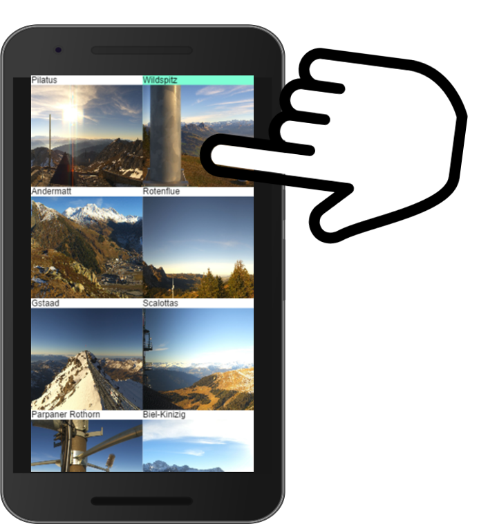
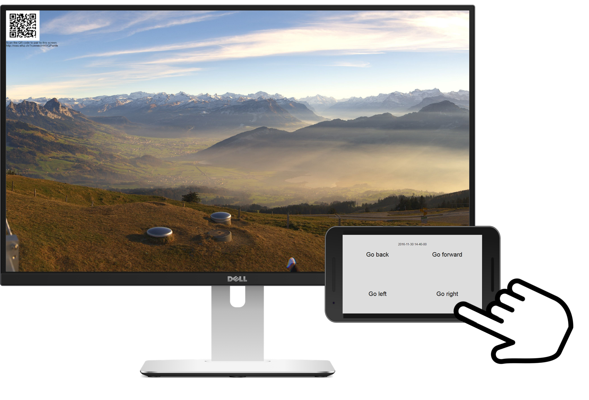

# Cross-device Web Cam Viewer

This is a web cam viewer that was built with the [XD-MVC cross-device framework](https://github.com/mhusm/XD-MVC)

The main use case in mind is a large screen showing the web cam and a phone acting as a controller.
The large screen just shows the web cam image and QR code for pairing the phones.

After scanning the code, the phone loads a list of web cams that can be displayed, highlighting the current one.

When the phone is flipped to landscape, it can be used to go back and forward in time and to control the camera position.

